```{r}
#| include: false
library(data.table)
library(ggplot2)
library(patchwork)

set.seed(20260618)

mu_a <- 47
mu_b <- 53
sd_a <- 10
sd_b <- 10
n_sim <- 6000

scenario_dt <- data.table(
  scenario = c(
    "No correlation",
    "Strong positive correlation",
    "Strong negative correlation"
  ),
  rho = c(0, 0.95, -0.95)
)

simulate_pair <- function(n, mu_a, mu_b, sd_a, sd_b, rho) {
  z1 <- rnorm(n)
  z2 <- rnorm(n)
  data.table(
    A = mu_a + sd_a * z1,
    B = mu_b + sd_b * (rho * z1 + sqrt(1 - rho^2) * z2)
  )
}

sim_dt <- scenario_dt[
  ,
  simulate_pair(n_sim, mu_a, mu_b, sd_a, sd_b, rho),
  by = .(scenario, rho)
]

summary_dt <- sim_dt[, .(
  cor_ab = cor(A, B)
), by = .(scenario, rho)]

summary_dt[, `:=`(
  sd_diff = sqrt(sd_a^2 + sd_b^2 - 2 * rho * sd_a * sd_b),
  p_a_lt_b = pnorm((mu_b - mu_a) / sqrt(sd_a^2 + sd_b^2 - 2 * rho * sd_a * sd_b))
)]

hist_dt <- rbindlist(list(
  data.table(variable = "A", value = sim_dt[scenario == "No correlation", A]),
  data.table(variable = "B", value = sim_dt[scenario == "No correlation", B])
))

point_dt <- data.table(
  variable = c("A", "B"),
  x = c(mu_a, mu_b)
)

x_limits <- c(20, 80)
x_breaks <- seq(20, 80, 10)
hist_y_max <- max(
  density(hist_dt[variable == "A", value], from = x_limits[1], to = x_limits[2])$y,
  density(hist_dt[variable == "B", value], from = x_limits[1], to = x_limits[2])$y
)
common_y_limits <- c(0, hist_y_max * 1.12)
point_dt[, y := common_y_limits[2] * 0.02]

base_theme <- theme_minimal(base_size = 24) +
  theme(
    panel.grid.major = element_blank(),
    panel.grid.minor = element_blank(),
    plot.title.position = "plot",
    plot.margin = margin(5.5, 18, 5.5, 18)
  )

make_point_plot <- function(point_size = 7, nudge = 0.08) {
  ggplot(point_dt, aes(x = x, y = y, color = variable)) +
    geom_density(
      data = hist_dt,
      aes(x = value, fill = NULL, color = NULL),
      inherit.aes = FALSE,
      alpha = 0.10,
      linewidth = 0
    ) +
    geom_point(size = point_size) +
    geom_text(
      aes(label = variable),
      nudge_y = common_y_limits[2] * nudge,
      show.legend = FALSE,
      fontface = "bold"
    ) +
    scale_color_manual(values = c("A" = "#1b9e77", "B" = "#d95f02")) +
    scale_x_continuous(limits = x_limits, breaks = x_breaks) +
    scale_y_continuous(limits = common_y_limits) +
    labs(
      title = NULL,
      subtitle = NULL,
      x = NULL,
      y = NULL
    ) +
    base_theme +
    theme(
      axis.text.y = element_blank(),
      axis.ticks.y = element_blank(),
      axis.title.y = element_blank(),
      axis.line.x = element_line(color = "grey60", linewidth = 1.2),
      legend.position = "none"
    )
}

make_hist_plot <- function(point_size = 7, nudge= 0.08, ...) {
  ggplot(point_dt, aes(x = x, y = y, color = variable)) +
    geom_density(
      data = hist_dt,
      aes(x = value, fill = variable, color = variable),
      inherit.aes = FALSE,
      alpha = 0.2,
      linewidth = 1
    ) +
    geom_point(size = point_size) +
    geom_text(
      aes(label = variable),
      nudge_y = common_y_limits[2] * nudge,
      show.legend = FALSE,
      fontface = "bold", 
      linewidth = ...
        
    ) +
    scale_color_manual(values = c("A" = "#1b9e77", "B" = "#d95f02")) +
    scale_fill_manual(values = c("A" = "#1b9e77", "B" = "#d95f02")) +
    scale_x_continuous(limits = x_limits, breaks = x_breaks) +
    scale_y_continuous(limits = common_y_limits) +
    labs(
      title = NULL,
      subtitle = NULL,
      x = NULL,
      y = NULL
    ) +
    base_theme +
    theme(
      axis.text.y = element_blank(),
      axis.ticks.y = element_blank(),
      axis.title.y = element_blank(),
      axis.line.x = element_line(color = "grey60", linewidth = 1.2),
      legend.position = "none"
    )
}

make_scatter_plot <- function(scenario_name) {
  stats <- summary_dt[scenario == scenario_name]
  ggplot(sim_dt[scenario == scenario_name], aes(x = A, y = B)) +
    geom_point(alpha = 0.22, size = 0.7, color = "#2c3e50", shape = 16) +
    geom_abline(
      intercept = 0,
      slope = 1,
      linetype = "dashed",
      color = "#b2182b",
      linewidth = 1
    ) +
    scale_x_continuous(limits = c(10, 90), breaks = seq(10, 90, 10)) +
    scale_y_continuous(limits = c(10, 90), breaks = seq(10, 90, 10)) +
    labs(
      title = sprintf("P(A < B) = %.2f", stats$p_a_lt_b),
      subtitle = NULL,
      x = "A",
      y = "B"
    ) +
    theme_minimal(base_size = 24) +
    theme(
      axis.text = element_text(size = 12)
    )
}
```

------------------------------------------------------------------------

::::: columns
::: {.column width="50%"}
### When complex IO models ...
:::

::: {.column width="50%"}
### become simple decisions
:::
:::::

::::::: model-decision-row
:::: model-decision-panel.fragment
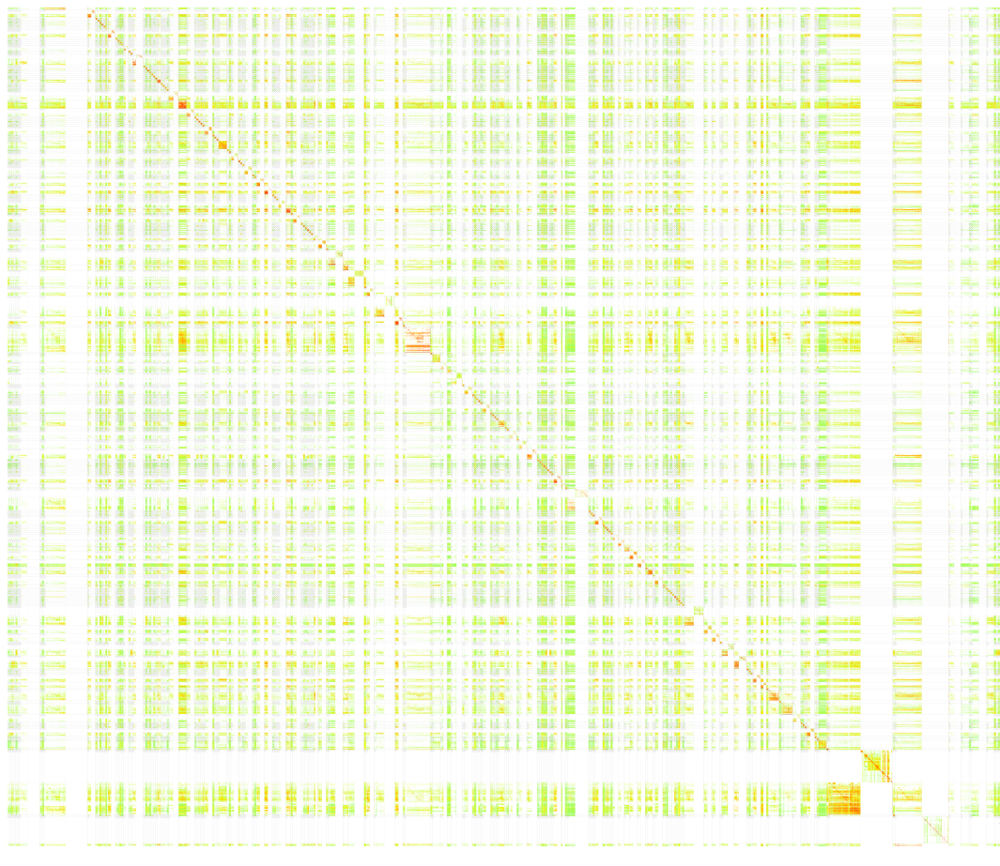{fig-alt="Complex model illustration"}

::: small-source
source: <a href="https://worldmrio.com/heatmap/">worldmrio.com/heatmap/</a>
:::
::::

::: model-decision-arrow.fragment
{fig-alt="Grey arrow"}
:::

::: model-decision-panel.fragment
{fig-alt="Decision between A and B"}
:::
:::::::

------------------------------------------------------------------------

## A simple question: is A \< B?

```{r}
#| fig-width: 9
#| fig-height: 4.2
make_point_plot()
```

-   Based on the point estimates alone, the answer looks obvious.

-   But point estimates hide uncertainty and dependence.

------------------------------------------------------------------------

## Add uncertainty

```{r}
#| fig-width: 9
#| fig-height: 4.2
make_hist_plot()
```

-   The means differ, but the marginals overlap.

-   So the question becomes probabilistic: what is `P(A < B)`?

------------------------------------------------------------------------

## Same marginals, different dependence

:::: columns
::: {.column width="100%"}
```{r}
#| fig-width: 6.8
#| fig-height: 2.6
#| fig-align: center
make_hist_plot(point_size = 2, nudge = 0.2)
```
:::
::::

:::::::: columns
::: {.column width="5%"}
:::

::: {.column .fragment width="30%"}
```{r}
#| fig-width: 4.1
#| fig-height: 3.6
#| fig-align: center
make_scatter_plot("No correlation")
```
:::

::: {.column .fragment width="30%"}
```{r}
#| fig-width: 4.1
#| fig-height: 3.6
#| fig-align: center
make_scatter_plot("Strong positive correlation")
```
:::

::: {.column .fragment width="30%"}
```{r}
#| fig-width: 4.1
#| fig-height: 3.6
#| fig-align: center
make_scatter_plot("Strong negative correlation")
```
:::

::: {.column width="5%"}
:::
::::::::

------------------------------------------------------------------------

## Why IO/SUT results are not independent

-   IOTs/SUTs are compiled from heterogeneous, incomplete and sometimes conflicting data sources

-   need for **balancing** (reconciliation) to satisfy key accounting and consistency constraints: e.g. supply = demand, input = output

-   accounting constraints induce **dependencies** between flows: more output requires more input, more demand requires more supply

-   Standard balancing (RAS, KRAS, WLS, cross-entropy, ...) yields **a single reconciled table** (often without uncertainty and dependencies)

------------------------------------------------------------------------

## The challenge

We need a balancing method that:

::: incremental
1.  can use heterogeneous **reliability information** in the balancing step

2.  provides the **uncertainty for the balanced table**

3.  accounts for **dependence induced by constraints**

4.  supports for **downstream uncertainty propagation** (e.g. $P(\mathrm{A}) > P(\mathrm{B})$)

5.  **scales** to the size of BONSAI
:::

------------------------------------------------------------------------

## BONSAI

::::: columns
::: {.column width="50%"}
-   Open climate footprint database: [bonsai.uno](bonsai.uno)

-   **Hybrid Supply-Use** system with multiple property layers

-   Layers are coupled via **conversion factors** (e.g., €/t, TJ/t, €/TJ)

-   dimensions: \~1700 products × \~1500 activities × 49 regions → **\>1.8M non-zero flows**
:::

::: {.column width="50%"}
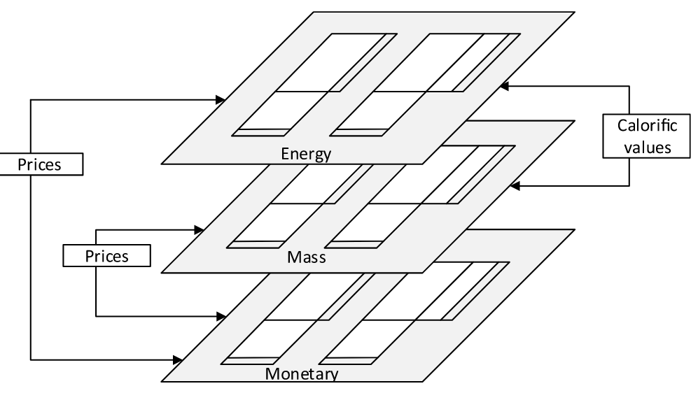
:::
:::::

------------------------------------------------------------------------

## The Bayes' Theorem

$$
{\color{#2E5CB8}{ p(\text{SUT} \mid \text{constraints})}}
=
\frac{
{\color{#B85C00}{p(\text{constraints} \mid \text{SUT})}}
\times
{\color{#556B2F}{p(\text{SUT})}}
}{
p(\text{constraints})
}
$$

. . .

-   $\color{#556B2F}{p(\text{SUT})}$ = **Prior distribution**
-   $\color{#B85C00}{p(\text{constraints} \mid \text{SUT})}$= **Likelihood**
-   ${\color{#2E5CB8}{ p(\text{SUT} \mid \text{constraints})}}$ = **Posterior distribution**
-   $p(\text{constraints})$ = Normalising constant

::: fragment
**=\> everything (supply/use flows, conversion factors, constraints) is a probability distribution!**
:::

------------------------------------------------------------------------

##  {.focus-prior}

$$
\class{posterior}{\color{#2E5CB8}{ p(\text{SUT} \mid \text{constraints})}}
=
\frac{
\class{likelihood}{\color{#B85C00}{p(\text{constraints} \mid \text{SUT})}}
\times
\class{prior}{\color{#556B2F}{p(\text{SUT})}}
}{
\color{#D3D3D3}{p(\text{constraints})
}}
$$

**Prior distribution**:

-   Our prior belief about the Supply & Use flows, conversion factors and transfer coefficients,
-   centered on the initial (unbalanced) SUT,
-   uncertainty/variance: ad-hoc approach for proof-of-concept
    -   flows subject to small imbalances -\> rel. small variance,
    -   flows subject to large imbalances -\> rel. large variance
    -   clamping to $[0.1, 0.5]$

------------------------------------------------------------------------

##  {.focus-likelihood}

$$
\class{posterior}{\color{#2E5CB8}{ p(\text{SUT} \mid \text{constraints})}}
=
\frac{
\class{likelihood}{\color{#B85C00}{p(\text{constraints} \mid \text{SUT})}}
\times
\class{prior}{\color{#556B2F}{p(\text{SUT})}}
}{
\color{#D3D3D3}{p(\text{constraints})
}}
$$

**Likelihood:**

-   How well a candidate SUT satisfies the accounting identities/constraints. SUTs that violate constraints get low probability.
-   Constraints used:
    -   product & activity balances (per region, per layer)
    -   cross-layer consistency via conversion factors
    -   transfer-coefficient consistency

::: notes
:::

------------------------------------------------------------------------

##  {.focus-likelihood}

$$
\class{posterior}{\color{#2E5CB8}{ p(\text{SUT} \mid \text{constraints})}}
=
\frac{
\class{likelihood}{\color{#B85C00}{p(\text{constraints} \mid \text{SUT})}}
\times
\class{prior}{\color{#556B2F}{p(\text{SUT})}}
}{
\color{#D3D3D3}{p(\text{constraints})
}}
$$

:::::: columns
::: {.column width="50%"}
**Likelihood:**

Modeled as soft log-ratio constraints:

$$
\log\frac{x_i+\epsilon}{x_j+\epsilon}\sim \mathcal{N}(0,\mathrm{rel\_tol}^2)
$$

-   $x_i, x_j$: quantities that should balance (e.g., total supply vs total use),
-   $\mathrm{rel\_tol}$: tolerance (controls strictness)
:::

:::: {.column width="50%"}
::: {.fragment .small-table}
| Constraint | rel_tol | 95% ratio bounds for $(x_i+ε)/(x_j+ε)$ |
|--------------------------|-----------------:|---------------------------:|
| Product balances | 0.05 | \[0.907, 1.103\] |
| Activity balances | 0.05 | \[0.907, 1.103\] |
| Conversion factor consistency | 0.10 | \[0.822, 1.217\] |
| Transfer coefficient consistency | 0.20 | \[0.676, 1.480\] |
:::
::::
::::::

------------------------------------------------------------------------

##  {.focus-posterior}

$$
\class{posterior}{\color{#2E5CB8}{ p(\text{SUT} \mid \text{constraints})}}
=
\frac{
\class{likelihood}{\color{#B85C00}{p(\text{constraints} \mid \text{SUT})}}
\times
\class{prior}{\color{#556B2F}{p(\text{SUT})}}
}{
\color{#D3D3D3}{p(\text{constraints})
}}
$$

**Posterior distribution:**

-   The distribution of balanced SUTs that are close to the initial data & consistent with all structural constraints.
-   we cannot compute the posterior in a closed-form
-   use MCMC (Monte Carlo Markov Chains) to approximate posterior

## MCMC to approximate posterior {.smaller}

::::: columns
::: {.column width="50%"}
![[^1]](figs/mcmc_illustration.png)
:::

::: {.column width="50%"}
1.  Find starting parameter position
2.  Propose to jump from that position to somewhere else
3.  Evaluate: Is it a "good" place to jump or not? $\text{P(accept) = P(proposal) / P(current)}$
4.  Each accepted state is recorded
5.  By running enough iterations we will approach the posterior distribution
:::
:::::

[^1]: Jin, Seung-Seop & Ju, Heekun & Jung, Hyung-Jo. (2019). Adaptive Markov chain Monte Carlo algorithms for Bayesian inference: recent advances and comparative study. Structure and Infrastructure Engineering. 10.1080/15732479.2019.1628077

[^2]: Jin, Seung-Seop & Ju, Heekun & Jung, Hyung-Jo. (2019). Adaptive Markov chain Monte Carlo algorithms for Bayesian inference: recent advances and comparative study. Structure and Infrastructure Engineering. 10.1080/15732479.2019.1628077

## Implementation & Computation

-   Implemented in Stan (using NUTS)
-   Successfully tested at BONSAI scale (\>1.8 Million flows, multi-layer)
-   run on HPC: 4 parallel chains and 500-1000 iterations per chain required on the order of 19 to 44 hours and 24 GB of RAM
-   processing the Stan output files with the current implementation requires around 200 GB of RAM

# Results

## 1a) how much does balancing move the table?

::::: columns
::: {.column width="50%"}
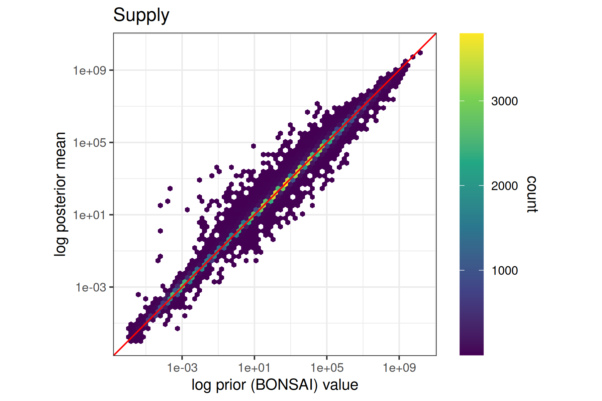{width="100%"}
:::

::: {.column width="50%"}
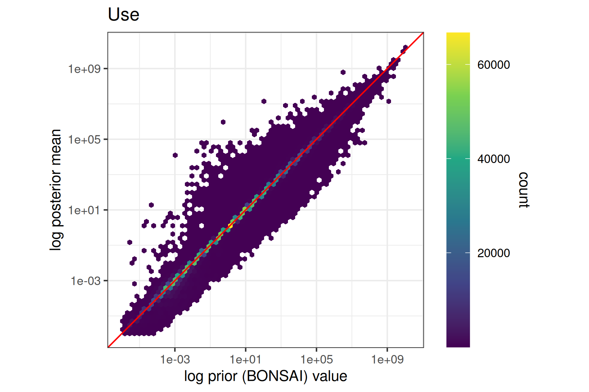{width="100%"}
:::
:::::

------------------------------------------------------------------------

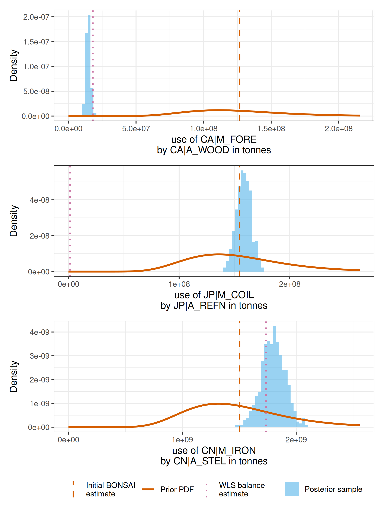

------------------------------------------------------------------------

## 2) uncertainty changes (selectively)

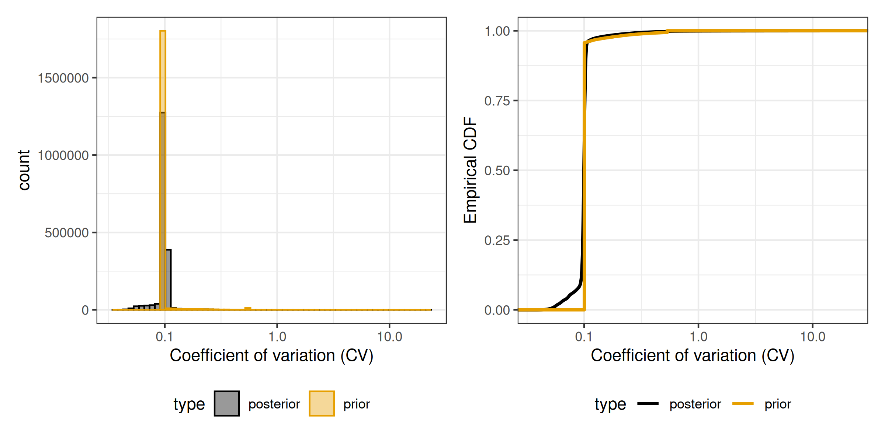{width="100%"}

------------------------------------------------------------------------

## 3) Before & After balancing

![Product constraint \[tonnes\]](plots/plot_prod_balance_tonnes.png){width="100%"}

------------------------------------------------------------------------

## 4) posterior covariance

:::::: columns
::: {.column width="50%"}
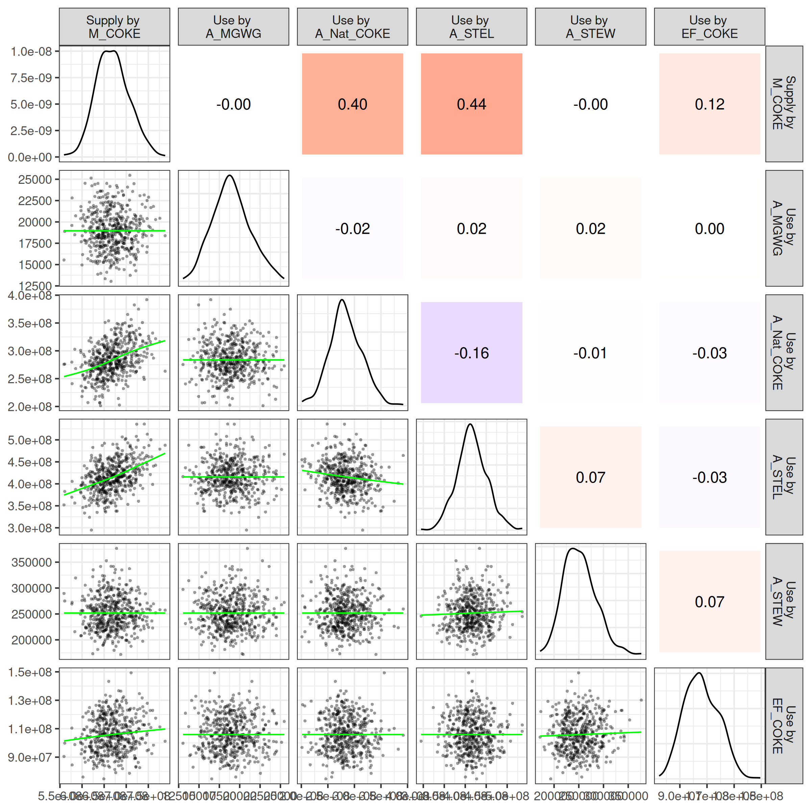{width="92%"}
:::

:::: {.column width="50%"}
-   M_COKE: Chinese coke market
-   A_Nat_COKE: natural coke production
-   A_STEL: steel manufacturing

::: {.callout-note .fragment}
Due to use of soft constraints that still allow for deviation from the constraints, we expect stronger dependencies when tightening the allowed log-ratio deviation from the constraints, which are currently set relatively moderate $\mathrm{rel\_tol}_*$ between 0.05 and 0.2
:::
::::
::::::

------------------------------------------------------------------------

## Limitations of the current prototype

-   prior variances largely data-driven based on prior imbalances (due to computational reasons)

-   global (coarse) uncertainty parameters for some linkages (conversion between layers, transfer coefficients)

-   soft constraints require care (tolerances matter)

-   computational optimisation: post-processing/memory pipeline, MCMC

------------------------------------------------------------------------

## Outlook

-   Empirically grounded prior elicitation (source/flow specific)
-   tighter tolerances
-   testing Bayesian approximations (e.g. Pathfinder, Variational Inference)
-   generalizations: zero handling, time-series (temporal consistency & information transfer)
-   create a usable tool

------------------------------------------------------------------------

## Closing the loop: from complex SUTs to robust decisions {.smaller}

::::: columns
::: {.column width="33%"}
**Where we started**

```{r}
#| fig-width: 4
#| fig-height: 2.2
make_point_plot(point_size = 2, nudge = 0.2) +
  theme(
    axis.text.x = element_text(size = 8),
    plot.margin = margin(2, 10, 2, 10)
  )

```

$A \quad \text{or} \quad B?$

Point estimates hide uncertainty and dependencies.
:::

::: {.column .fragment width="66%"}
**Bayesian balancing provides**

```{r}
#| fig-width: 8
#| fig-height: 2.2
p1 <- make_hist_plot(point_size = 2, nudge = 0.2) +
  theme(
    axis.text.x = element_text(size = 8),
    plot.margin = margin(2, 10, 2, 10)
  )

p2 <- make_scatter_plot("Strong negative correlation") +
  theme(
    plot.title = element_text(size = 16),
    axis.text = element_text(size = 8),
    axis.title = element_blank(),
    plot.margin = margin(2, 10, 2, 10)
  )

p1 + p2

```

-   a posterior ensemble of balanced SUTs
-   uncertainty intervals and covariances
-   diagnostics of data–constraint tensions
-   direct propagation to decision probabilities

$P(\text{footprint}_A < \text{footprint}_B\mid \text{data, constraints})$
:::
:::::

------------------------------------------------------------------------

## Thank you

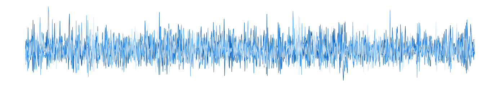{width="1260"}


::::: columns
::: {.column width="66%"}


-   Slides: <https://simschul.github.io/2026_IO_workshop/>
-   Working paper: <https://freidok.uni-freiburg.de/data/279579> -->
- Contact: [simon.schulte\@indecol.uni-freiburg.de](simon.schulte@indecol.uni-freiburg.de)


:::

::: {.column width="33%"}


:::
:::::


--------------------------------------------------------------


## Discussion

1.  What tolerances (=deviations from constraints) would you consider acceptable for the respective constraints?

2.  What kind of uncertainty info can statistical offices provide (to be encoded as priors)?

3.  IO practitioners:

    -   What would you need to make use of such an uncertainty-aware SUT? (data: full samples, covariances, ...; tools: integration in pymrio/MARIO? stand-alone library?)
    -   Which challenges do you see for practitioners?

------------------------------------------------------------------------

# Additional slides

# The model

## Model variables (1)

Supply & Use flows:

$$
\log x^{(\mathrm{sup},l)}_i \sim \mathcal{N}\bigl(\mu^{(\mathrm{sup},l)}_i,\;\sigma^{(\mathrm{sup},l)\,2}_i\bigr)
$$

$$
\log x^{(\mathrm{use},l)}_i \sim \mathcal{N}\bigl(\mu^{(\mathrm{use},l)}_i,\;\sigma^{(\mathrm{use},l)\,2}_i\bigr)
$$

Conversion factors:

$$
x^{(cf,l_1\rightarrow l_2)}_i \sim \mathcal{N}(y^{(cf,l_1\rightarrow l_2)}_i,\;\sigma^{(cf,l_1\rightarrow l_2)2}_i)
$$

## Model variables (2)

Transfer coefficient:

$$
x^{(\mathrm{tc})}_i \sim \mathrm{Beta}(\alpha^{(\mathrm{tc})}_i,\;\beta^{(\mathrm{tc})}_i)
$$

$$
y^{(\mathrm{tc})}_i \sim \mathcal{N}(x^{(\mathrm{tc})}_i,\;\sigma^{(\mathrm{tc})2}_i)
$$

## Prior variances (Supply & Use flows) (1)

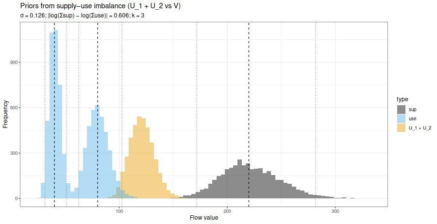

## Prior variances (Supply & Use flows) (2)

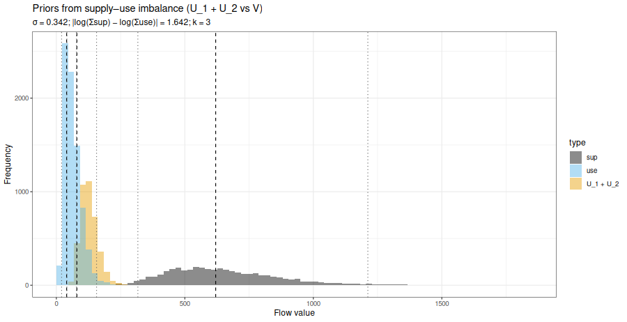

## Prior variances (Supply & Use flows) (3)

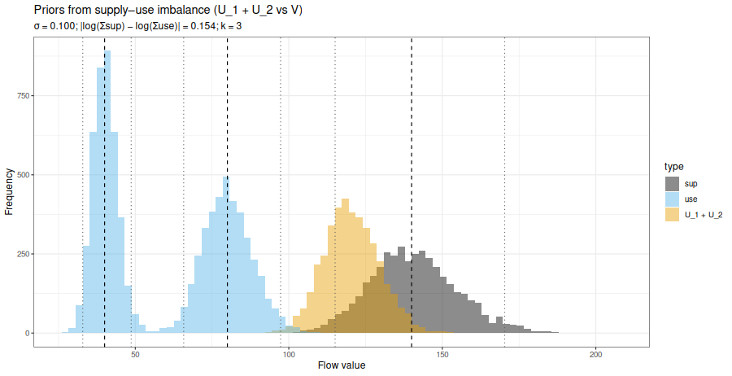

------------------------------------------------------------------------


## Product & Activity constraints

Product constraint:

$$
\log\frac{s^{(l)}_{\mathrm{pr},j} + \epsilon}{l^{(l)}_{\mathrm{pr},j} + \epsilon}
\sim \mathcal{N}(0,\;\mathrm{rel\_tol}_{\mathrm{product}}^2)
$$

Activity constraint:

$$
\log\frac{o^{(l)}_{\mathrm{ar},k} + \epsilon}{i^{(l)}_{\mathrm{ar},k} + \epsilon}
\sim \mathcal{N}(0,\;\mathrm{rel\_tol}_{\mathrm{activity}}^2)
$$

## Conversion factor consistency

$$
\text{converted}^{(\mathrm{sup},l_2)}_i
=
x^{(\mathrm{sup},l_1)}_i \cdot x^{(cf,l_1\rightarrow l_2)}_i,
$$

$$
\text{reference}^{(\mathrm{sup},l_2)}_i = x^{(\mathrm{sup},l_2)}_i
$$

(and analogously for use flows $x^{(\mathrm{use},l)}$).

Soft log-ratio constraint:

$$
\log \frac{
\text{converted}^{(\cdot)}_i + \epsilon
}{
\text{reference}^{(\cdot)}_i + \epsilon
}
\sim \mathcal{N}\!\left(0,\;\mathrm{rel\_tol}_{\mathrm{conv\_fac}}^{2}\right)
$$

## Transfer coefficient consistency {.smaller}

-   First, we have to aggregate supply and use to the product-activity-region (PAR) level (e.g.\~total use of steel in car manufacturing in Germany, or supply of cars from car manufacturing in Germany) using aggregation matrices $\mathbf{A}^{(\cdot)}_{par}$ : $$
    \mathbf{x}^{(\mathrm{use},\mathrm{tonnes})}_{\mathrm{par}} = \mathbf{A}^{(\mathrm{use},\mathrm{tonnes})}_{\mathrm{par}} \, \mathbf{x}^{(\mathrm{use},\mathrm{tonnes})} ; 
    \mathbf{x}^{(\mathrm{sup},\mathrm{tonnes})}_{\mathrm{par}} = \mathbf{A}^{(\mathrm{sup},\mathrm{tonnes})}_{\mathrm{par}} \, \mathbf{x}^{(\mathrm{sup},\mathrm{tonnes})}
    $$

-   Second, we compute the expected supply from the transfer coefficients by multiplying the transfer coefficient record with the respective use-flow at the PAR-level: $$
    x^{(\mathrm{exp\_sup},\mathrm{tonnes})}_{\mathrm{par},i}
    =
    x^{(\mathrm{tc})}_i \cdot
    x^{(\mathrm{use},\mathrm{tonnes})}_{\mathrm{par}, i}
    $$

-   Third, we again apply a soft log-ratio constraint so that the observed PAR-level supplies in tonnes must approximately match expected supplies implied via transfer coefficients: $$
      \log\frac{ x^{(\mathrm{exp\_sup},\mathrm{tonnes})}_{\mathrm{par},i} + \epsilon }{ x^{(\mathrm{sup},\mathrm{tonnes})}_{\mathrm{par},i} + \epsilon } \sim \mathcal{N}\left(0, \mathrm{rel\_tol}_{\mathrm{tc}}^{2}\right)
      $$

## Before/After balancing (product balance, Mill. Euro)

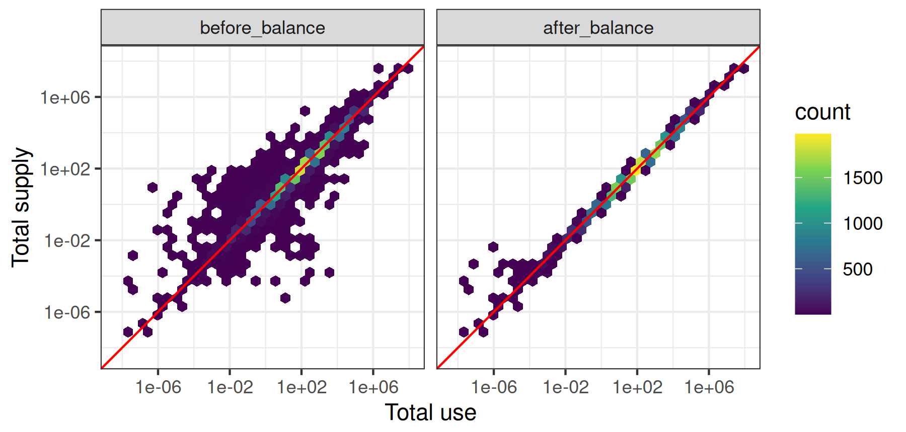

## Before/After balancing (product balance, TJ)

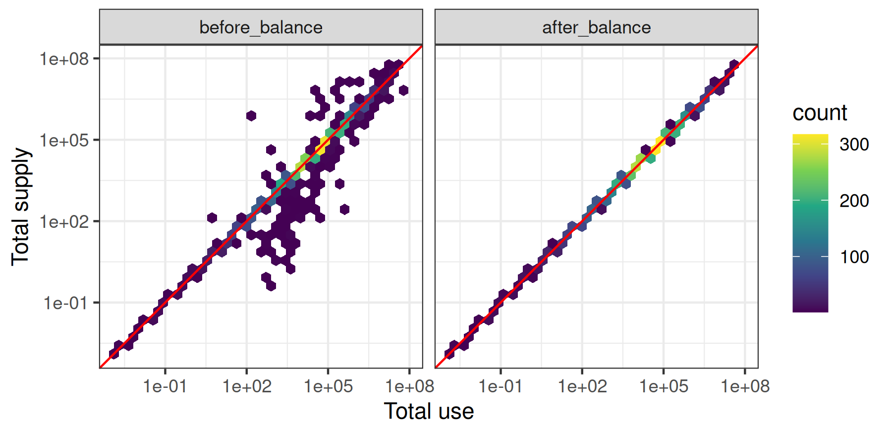

## Before/After balancing (activity balance, tonnes)

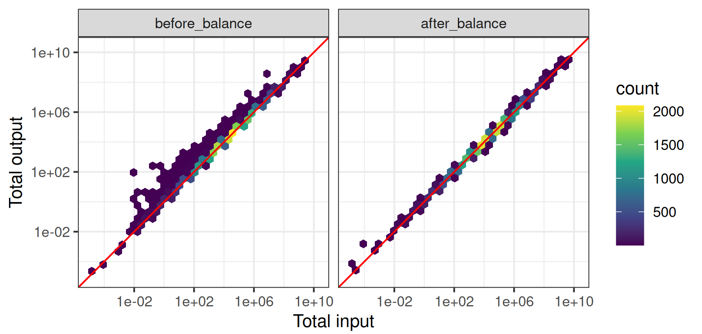

## Before/After balancing (activity balance, Mill. Euro)

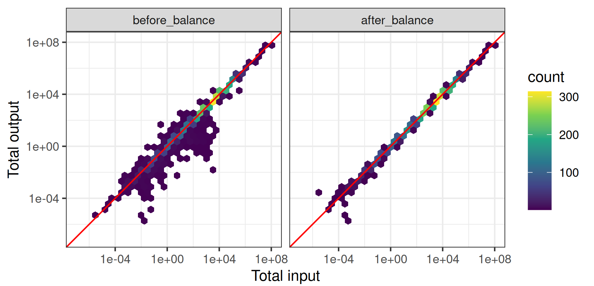

## Before/After balancing (activity balance, TJ)

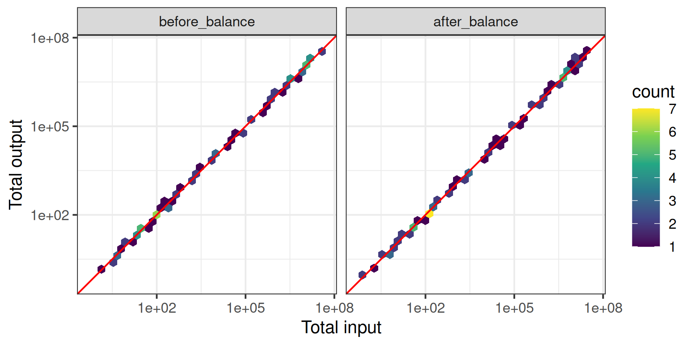

## Comparison with deterministic WLS

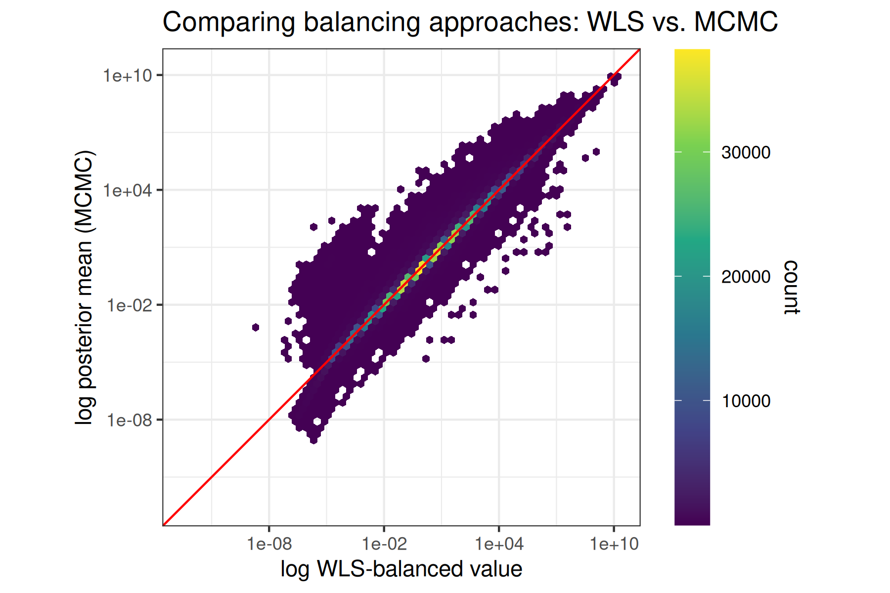{width="100%"}
